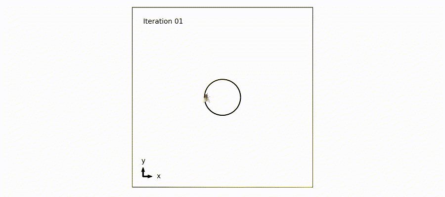

# lesser-house-boids

## Introduction

#### What?
I'm trying to build a simple model of the flight of the lesser house fly (_Fannia canicularis_).

#### Why?

During the summer months, I lie beneath a fabulous pendant lampshade (thank you [IKEA](https://www.ikea.com/gb/en/p/krusning-pendant-lamp-shade-white-50259921/)) which is often the resting spot for a small number of flies doing their thing. And their thing is kind of cool. I have observed three distinct flight behaviours
1. resting on the pendant lampshade
2. a slow, square-like trajectory of approximately 40cm in width,
3. and a rapid, more irregular "zooming" behaviour when near another fly

Having noticed these distinct behaviours, I asked why they do this. And found that [someone has documented](https://www.jstor.org/stable/4599948) the properties of the fly's flight, and talked about some of the reasons they do it. The 1986 paper includes some figures which I very much appreciated. And basically, I wanted to reproduce them.

#### How?

Creating a simulation of lesser house flies lends its perfectly to agent-based modelling: where you give each fly (or agent) a prescribed list of behaviours, and see how they interact to create larger emergent behaviours. Specifically, it might be interesting to see how the prescribed behaviours need to be defined in order to observe "zooming" at a similar frequency to real life.

Agent-based modelling is super cool. Watching animals flock and swoop and zoom is incredible and simple agent-based models have given insight into how emergent behaviours of large groups come about. Agent-based modelling has also been applied in cell biology to study morphogenesis, tumour growth and metastasis and formation of bacterial biofilms. These types of models (particularly as applied to morphogensis) are relevant to the work done in my PhD.

## Building

I think the ideal model would consist of multiple flies interacting in 3 dimensions, with all three behaviours. However, when building models I try to start simple and build up. So,

Iteration 1: 1 fly resting in 2 dimensions.

Plan for iteration 2: 1 fly moving in a stright line. This will involve a few steps:
- Updating orientation (or rotation) of fly png based on `velocity`.
- Using `velocity` to create movement. It currently isn't used at all.
- Adding movement to the `animation` function. This function is currently empty.

As an additional goal, I'm going to program in a third spatial dimension now. This will make it much easier to adapt in future.

Here is a little gif showing progress so far:

## References

Figure reproduced from 
Jochen Zeil. (1986). The Territorial Flight of Male Houseflies (Fannia canicularis L.). _Behavioral Ecology and Sociobiology_, 19(3), 213–219. [URL](http://www.jstor.org/stable/4599948)

Fly png images are downloaded from [PNGWING](https://www.pngwing.com/).

